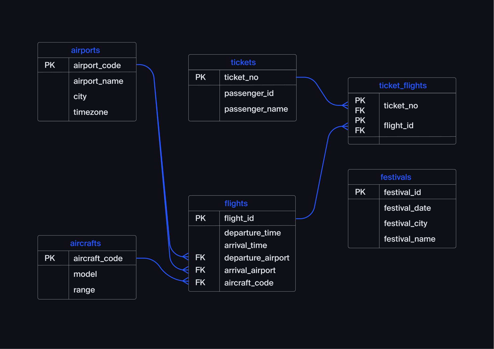

# Описание данных

В вашем распоряжении база данных об авиаперевозках.

Таблица airports — информация об аэропортах:

* airport_code — трёхбуквенный код аэропорта
* airport_name — название аэропорта
* city — город
* timezone — временная зона

Таблица aircrafts — информация о самолётах:

* aircraft_code — код модели самолёта
* model — модель самолёта
* range — дальность полёта
* Таблица tickets — информация о билетах:
* ticket_no — уникальный номер билета
* passenger_id — персональный идентификатор пассажира
* passenger_name — имя и фамилия пассажира

Таблица flights — информация о рейсах:

* flight_id — уникальный идентификатор рейса
* departure_airport — аэропорт вылета
* departure_time — дата и время вылета
* arrival_airport — аэропорт прилёта
* arrival_time — дата и время прилёта
* aircraft_code — id самолёта

Таблица ticket_flights — стыковая таблица «рейсы-билеты»

* ticket_no — номер билета
* flight_id — идентификатор рейса

Таблица festivals — информация о фестивалях

* festival_id — уникальный номер фестиваля
* festival_date — дата проведения фестиваля
* festival_city — город проведения фестиваля
* festival_name — название фестиваля

Схема таблиц

Пояснение: В базе данных нет прямой связи между таблицами airports и festivals, а также festivals и flights. Но вы можете писать JOIN и связывать эти таблицы по городу проведения фестиваля (festival_city) и городу аэропорта (city). Потребуется некоторое преобразование дат в flights, и тогда эту таблицу также можно будет связать по дате проведения фестиваля (festival_date) в запросах с JOIN.

## Задания

1. Найдите количество рейсов на каждой модели самолёта с вылетом в сентябре 2018 года. Назовите получившееся поле flights_amount и выведите его. Также напечатайте на экране поле model.
1. Посчитайте количество рейсов по всем моделям самолётов Boeing и Airbus в сентябре. Назовите получившуюся переменную flights_amount и выведите её.
1. Посчитайте среднее количество прибывающих рейсов в день для каждого города за август 2018 года. Назовите получившееся поле average_flights, вместе с ним выведите столбец city.
1. Установите фестивали, которые проходили с 23 июля по 30 сентября 2018 года в Москве, и номер недели, в которую они проходили. Выведите название фестиваля festival_name и номер недели festival_week.
1. Для каждой недели с 23 июля по 30 сентября 2018 года посчитайте количество приобретённых билетов в Москву. Номер недели назовите week_number, количество билетов — ticket_amount.

    Вы получите таблицу с такими столбцами:

   * week_number — номер недели из вашего запроса;
   * ticket_amount — количество купленных за неделю билетов;
   * festival_week — номер недели из предыдущего запроса. Будет равен nan, если фестиваля в эту неделю не было.
   * festival_name — название фестиваля. Будет равен nan, если фестиваля в эту неделю не было.
